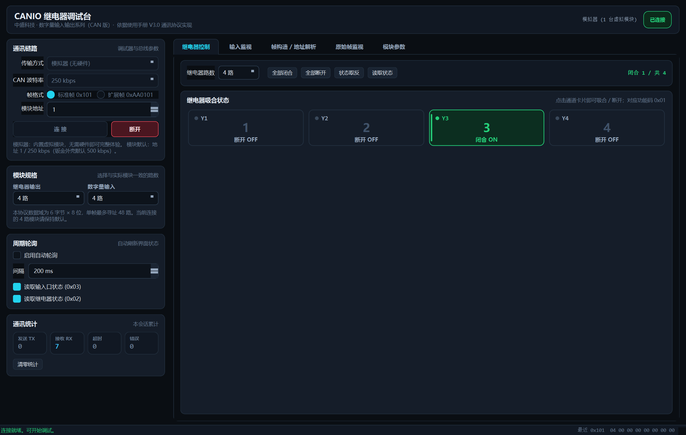
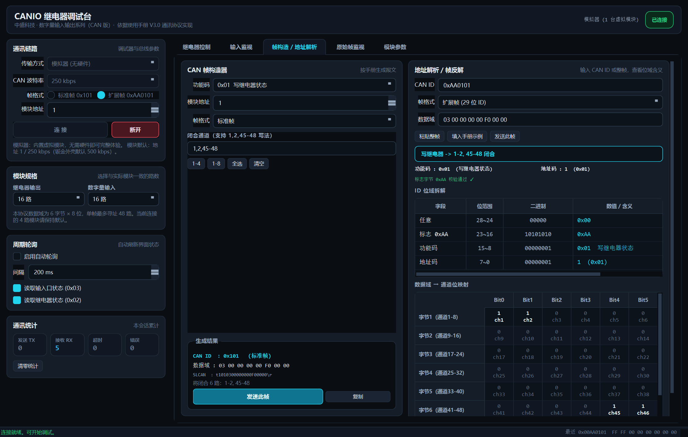
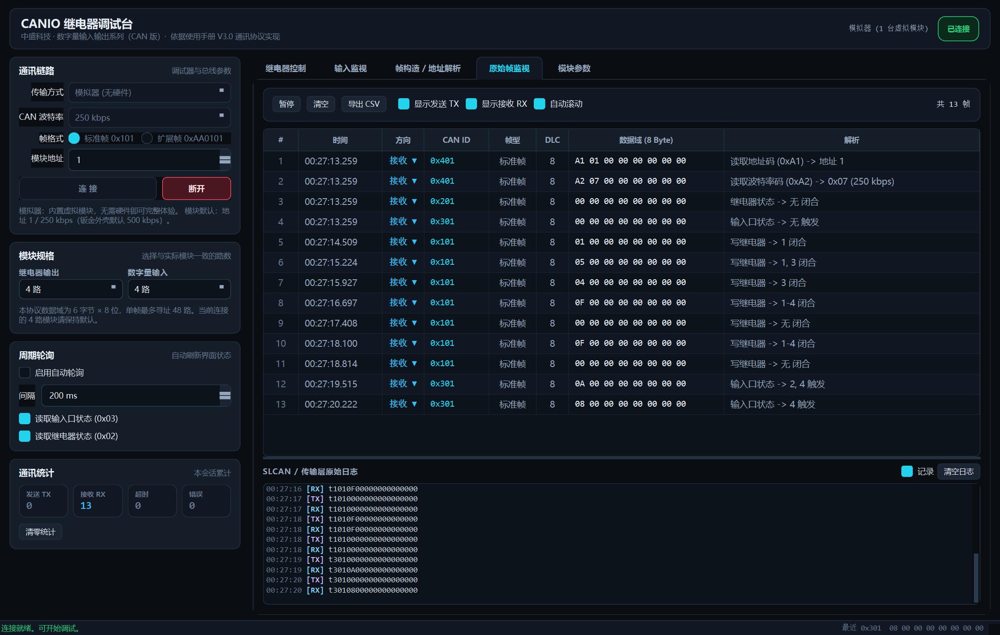
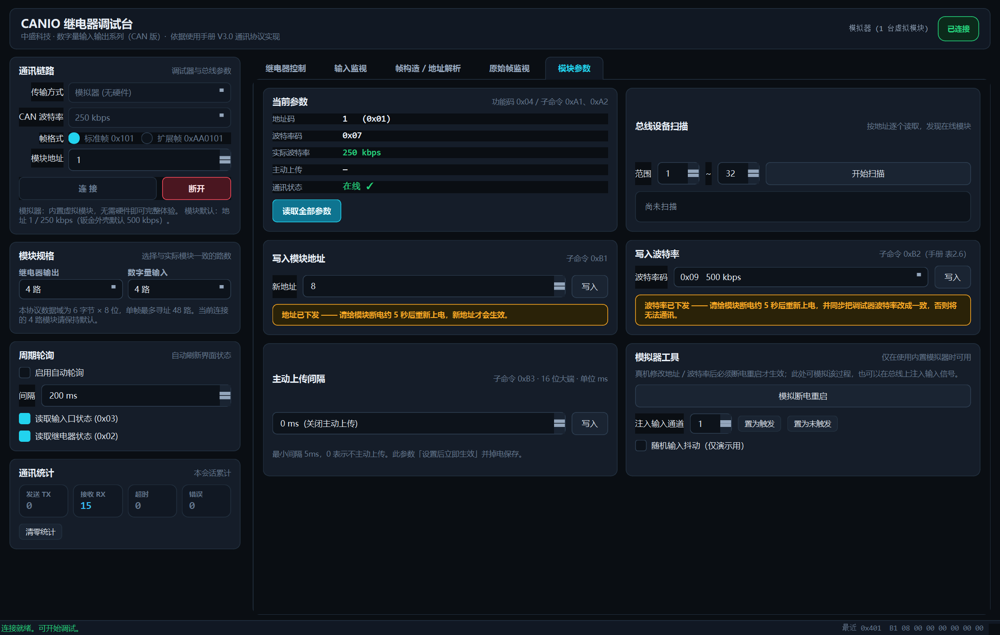

# zskj-canio-tool · CANIO 继电器调试台

> 中盛科技（东莞）**数字量输入输出系列（CAN 版）** 模块的 PC 上位机调试工具。
> 单文件绿色 EXE，双击即用；支持 **SLCAN 串口 / PCAN-Basic / 内置模拟器** 三种通道。
> 协议实现严格对齐官方《数字量输入输出系列使用手册（CAN 版）V3.0》第 2 章。

[](#)
[](https://www.python.org/)
[](https://doc.qt.io/qtforpython/)
[](LICENSE)

---

## 特性

| | |
|---|---|
| **继电器控制** | 通道磁贴点击即切换；全部闭合 / 全部断开 / 状态取反 / 读回；1~48 路规格可选 |
| **输入监视** | 数字量输入触发指示灯 + 触发次数统计；支持周期轮询 |
| **帧构造 / 地址解析** | 左造帧（支持 `1,2,45-48` 表达式），右解帧：CAN ID 位域逐位拆解 + 数据域→通道位映射图 |
| **原始帧监视** | 报文级表格（时间/方向/ID/帧型/DLC/数据域/中文解析）+ 底层 ASCII 日志，可暂停、导出 CSV |
| **模块参数** | 地址码 / 波特率码 / 主动上传间隔在线读写；总线设备扫描 |
| **三种通道** | SLCAN 串口 · PCAN-Basic · 内置模拟器（无硬件也能完整体验） |

> 📦 **直接下载**：[最新 Release](https://github.com/BI7KHI/zskj-canio-tool/releases/latest) · 单文件 EXE 44.9 MB · SHA256 `3744ad975e308427f7062d7332f40dca6d7eff0628e915414635d0b8635d98af`

**工程上的几个要点**

- `canio/` 层**完全不依赖 GUI**，可单独用于脚本化测试或集成进其它程序
- 报文列表做了批处理刷新（70 ms 合并 + 行数上限），高频 CAN 数据下界面不卡顿
- 所有阻塞操作（开串口、请求等待、扫描）跑在线程池，界面永不冻结
- 协议层有 **逐条比对手册示例** 的自检，文档示例也有自动一致性测试

---

## 截图






---

## 快速开始

### 方式一：下载打包好的 EXE（推荐）

到 [**Releases**](https://github.com/BI7KHI/zskj-canio-tool/releases) 页面下载最新版
`zskj-canio-tool-v1.0.0.exe`，**双击即用**，无需安装 Python 或任何依赖。

> 本地用 `python build.py` 自行打包时，输出文件名为 `dist/CANIO继电器调试台.exe`，内容与 Release 完全一致。

> 未安装 `PCANBasic.dll` 时 PCAN 选项会自动禁用，不影响 SLCAN 与模拟器。

### 方式二：从源码运行

```bash
pip install -r requirements.txt
python app.py
```

只想看看界面？把左侧「传输方式」选成 **模拟器（无硬件）** 再点连接即可，
内置虚拟模块完整仿真 `0x01`~`0x04` 全部功能码。

### 连接步骤

1. USB-CAN 转接器插到电脑，装好驱动，确认设备管理器里出现 COM 口
2. 转接器的 **CAN_H / CAN_L** 接到模块的 **H / L**，按要求接好终端电阻
3. 模块上电（6~36 V DC）
4. 软件左侧「通讯链路」里选好串口与参数，点 **连接**

| 参数 | 说明 |
|---|---|
| 传输方式 | `SLCAN (串口)` / `PCAN-Basic` / `模拟器` |
| 串口波特率 | USB 侧波特率，多数 SLCAN 固件为 `115200` |
| CAN 波特率 | **必须与模块一致**，出厂默认 `250 kbps`（钣金外壳默认 500 kbps） |
| 帧格式 | 标准帧 `0x101` 或扩展帧 `0xAA0101` |
| 模块地址 | 出厂默认 `1` |

---

## 通讯协议

完整的协议帧说明见 **[docs/PROTOCOL.md](docs/PROTOCOL.md)**，包含：

- 标准帧 / 扩展帧的 ID 位定义与构造公式
- 8 字节数据域 ↔ 48 路通道的完整位映射表
- 功能码 `0x01` ~ `0x04` 逐条说明
- 参数设置子命令、波特率码表、主动上传间隔字节序
- 手册全部报文示例 + 传输层（SLCAN / PCAN）映射
- 实现时的 7 个易踩坑点

### 速查

| 功能码 | 含义 |
|---|---|
| `0x01` | 写继电器状态（整组覆盖，模块原样回显） |
| `0x02` | 读继电器状态 |
| `0x03` | 读输入口状态（**Bit=1 表示已触发**） |
| `0x04` | 参数设置（`A1`/`A2` 读，`B1`/`B2`/`B3` 写） |

```
标准帧 ID = (功能码 << 8) | 地址码                     例: 0x101
扩展帧 ID = (0xAA << 16) | (功能码 << 8) | 地址码       例: 0xAA0101
```

数据域第 1~6 字节依次承载通道 1-8 / 9-16 / 17-24 / 25-32 / 33-40 / 41-48，
字节内 `Bit0→Bit7` 对应低通道→高通道，第 7、8 字节保留。

```
写继电器 1-2、45-48 闭合:   0x101  03 00 00 00 00 F0 00 00
```

### 三个最容易踩的坑

1. **写继电器是整组覆盖** —— 未置位的通道会被断开；改一路要「读-改-写」
2. **地址 / 波特率写入后必须断电重启才生效**，且模块收到写命令时仍用**原地址**应答，
   上位机此时不能立刻切换目标地址，否则立即失联
3. **主动上传间隔是 16 位大端** —— 手册示例 `B3 00 0A` 表示 10 ms（不是 2560 ms）

---

## 支持的调试器

### SLCAN / Lawicel（默认）

面向 CANable、CANtact，以及绝大多数 CH340 / CH343 / CP2102 / FT232 / STM32-VCP
等 USB-CAN 转接器。ASCII 命令以 `CR` 结尾：`S<n>` 设波特率、`O`/`C` 开关通道、
`tIIIDDDD…` / `TIIIIIIIIDDDD…` 收发帧。

> ⚠ SLCAN 标准档位只有 10/20/50/100/125/250/500/800/1000 kbps。
> 模块的 **200 kbps（`0x06`）与 400 kbps（`0x08`）不在其中**，需改用 PCAN 或自定义时序固件。

### PCAN-Basic

通过 `ctypes` 调用 PEAK 官方 `PCANBasic.dll`，支持 ISA / PCI / USB / LAN / Virtual 通道族，
可枚举当前可用通道。适用于正品 PEAK 硬件，以及烧录了 PCAN 固件的兼容转接器。

### 内置模拟器

完整仿真功能码 `0x01`~`0x04`，并复现真机的易错行为：写地址/波特率后不立即生效，
需「模拟断电重启」才切换。可注入输入信号，可选随机输入抖动。

---

## 项目结构

```
.
├── app.py                  # 程序入口（--selftest / --check）
├── build.py                # PyInstaller 单文件打包
├── canio/                  # 与界面无关的协议与通讯层
│   ├── protocol.py         #   协议编解码（帧 / ID / 通道 / 参数）
│   ├── session.py          #   请求应答配对、状态缓存、轮询、地址扫描
│   └── transport/
│       ├── base.py         #   传输层抽象接口
│       ├── slcan.py        #   SLCAN 串口
│       ├── pcan.py         #   PCAN-Basic (ctypes)
│       └── simulator.py    #   虚拟模块
├── ui/                     # PySide6 界面
│   ├── theme.py            #   深色主题 QSS
│   ├── widgets.py          #   卡片 / LED / 通道磁贴 / 位域表
│   ├── controller.py       #   后台线程 -> Qt 信号桥接
│   ├── main_window.py
│   └── panels/             #   各功能页
├── docs/
│   ├── PROTOCOL.md         #   协议帧说明
│   └── screenshots/
└── tests/                  # 自检脚本
```

---

## 开发与测试

```bash
python tests/test_protocol.py     # 协议层：逐条比对手册全部示例
python tests/test_session.py      # 会话 / 传输 / 模拟器 端到端
python tests/test_docs.py         # 文档一致性（PROTOCOL.md 里的示例逐条跑一遍）
python tests/test_gui_smoke.py    # 界面全流程冒烟 + 输出截图

python app.py --selftest          # 一次性跑完前面几项
```

打包后的 EXE 也带自检，结果写成 JSON，便于无控制台环境排查：

```bash
# 本地打包产物
dist/CANIO继电器调试台.exe --check out.json
# Release 下载的版本
zskj-canio-tool-v1.0.0.exe --check out.json
```

---

## 重新打包

```bash
python build.py            # 生成 dist/CANIO继电器调试台.exe 并自动自检
python build.py --clean    # 只清理构建产物
python build.py --no-verify
```

---

## 常见问题

**连不上 / 只有发送没有接收**

1. **CAN 波特率必须与模块一致** —— 出厂 250 kbps，钣金外壳 500 kbps，先试这两档
2. 检查 `H(CAN+)`、`L(CAN-)` 是否接反；总线两端是否需要 120 Ω 终端电阻
3. 确认串口没被其它软件占用（串口助手、厂家自带的综合测试系统等）
4. 确认选中的是 **USB-CAN 转接器** 的 COM 口，而不是蓝牙虚拟串口
5. 模块若被设过「主动上传」，总线上会一直有报文 —— 用「原始帧监视」即可看到
6. 主站同时接多台设备时注意地址冲突，用「模块参数 → 总线设备扫描」排查

**改完地址 / 波特率就联系不上了**

这两个参数**需断电约 5 秒后重新上电**才生效。生效后软件里的「模块地址」和
「CAN 波特率」也要同步改过去，否则会一直超时。

**输入口一直不触发**

数字量输入需要 **DC 10~30 V** 电压。无源干接点接线时要额外给输入端接一组电源：
`XCOM` 接电源正极为 NPN（低电平触发），接电源负极为 PNP（高电平触发）。

**继电器动作了但负载不工作**

继电器输出是 **无源干接点**，不会自己输出电压。必须把继电器触点、电源、负载
串成一个回路，由触点控制回路通断。

---

## 许可

本项目代码以 [MIT](LICENSE) 许可发布。

协议实现依据中盛科技公开的产品使用手册；**手册与产品资料的版权归
中盛科技（东莞）有限公司所有**，本仓库不再分发其 PDF 原文，
如需请向厂商索取。
